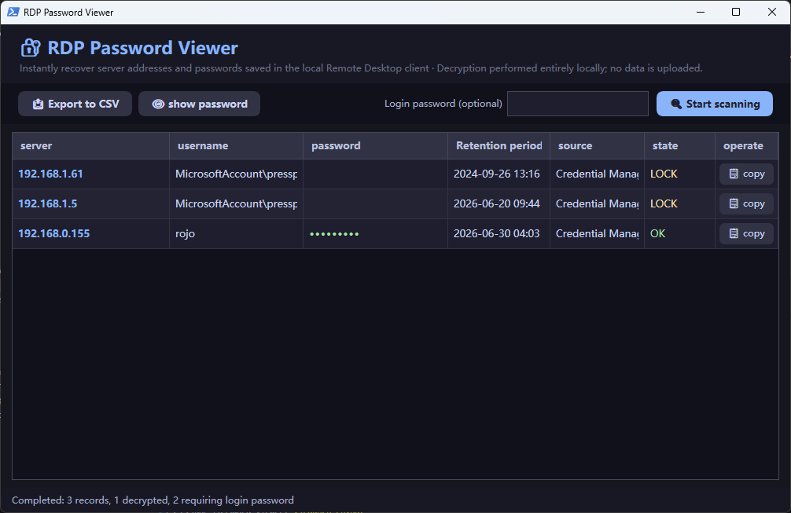
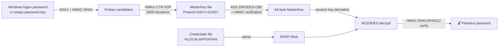

<div align="center">

# 🔐 RDP Password Viewer

**One-click recovery of RDP passwords saved on your Windows machine.**

*Forgot the admin password of that server you saved in Remote Desktop last year? This tool gets it back — locally, instantly, zero dependencies.*

[](#)
[](#)
[](#)
[](LICENSE)
[](#)

[English](README.md) · [简体中文](README.zh-CN.md)



*Demo data shown — TEST-NET reserved IPs, no real credentials.*

</div>

---

## 🤔 Why?

You clicked **"Remember me"** in `mstsc.exe` six months ago. The password has been sitting
in Windows Credential Manager ever since — Windows happily uses it every time you connect,
but never shows it to you again. Until you need to connect from **another machine**.

That's what this tool solves. It digs the password back out of:

| Source | What's recovered |
|:---|:---|
| 🗃️ **Credential Manager** | `TERMSRV/*` entries saved by mstsc (domain & generic types) |
| 📁 **Credential files** | DPAPI-encrypted blobs under `%LOCALAPPDATA%\Microsoft\Credentials` |
| 📄 **`.rdp` files** | `full address:` + `password 51:b:` blobs in Documents / Desktop |
| 🕘 **Connection history** | Registry MRU list of servers (with username hints) |

## ✨ Features

- 🎯 **One-click** — opens, scans, decrypts automatically. No install, no admin rights
- 🔓 **Beats `CRYPTPROTECT_SYSTEM`** — raw DPAPI re-implementation decrypts blobs Windows refuses to hand to user-mode `CryptUnprotectData`
- 🧊 **Zero dependencies** — single `.ps1` file; crypto runs on the built-in `bcrypt.dll`, no Python / mimikatz / downloads
- 🛡️ **100% offline** — everything happens in local memory; nothing is transmitted anywhere
- 🎨 **Clean dark UI** — WPF interface with copy buttons, password masking, CSV export
- 🇨🇳 **Chinese UI**, English README — UI language contributions welcome!

## 🚀 Quick Start

> [!IMPORTANT]
> Use this **only on your own computer** to recover **your own** saved credentials.

1. Download / clone this repo
2. Double-click **`Launch-en.bat`**
3. Done. If domain credentials show 🔒, type your **Windows logon password** (not your PIN) and rescan

<details>
<summary>🖥️ Command-line mode</summary>

```powershell
powershell -ExecutionPolicy Bypass -File RDP_Password_Viewer-en.ps1 -NoGui
powershell -ExecutionPolicy Bypass -File RDP_Password_Viewer-en.ps1 -NoGui -LoginPassword "your-win-password"
```

</details>

<details>
<summary>⚙️ How the decryption chain works</summary>



Windows protects mstsc-saved (domain-type) credentials with a `CRYPTPROTECT_SYSTEM` flag —
user-mode `CryptUnprotectData` fails with `ERROR_INVALID_DATA` no matter what you try
(elevating, impersonation, flag-patching all fail). This tool implements the DPAPI internals
directly instead: prekey derivation → masterkey KDF → blob session-key derivation →
symmetric decryption with full HMAC integrity checks.

</details>

## 🆚 Comparison

| | **RDP Password Viewer** | NirSoft NetworkPasswordRecovery | mimikatz |
|:---|:---:|:---:|:---:|
| No download / pre-installed tooling | ✅ | ❌ exe download | ❌ |
| Zero dependencies | ✅ | ✅ | ✅ |
| Reads LSASS memory (AV-friendly) | ❌ **never** | ❌ | ⚠️ yes |
| Needs admin | ❌ | ⚠️ sometimes | ✅ |
| Source readable in one file | ✅ | ❌ | ⚠️ C++ |
| Nice GUI | ✅ | ✅ | ❌ |

## ❓ FAQ

<details>
<summary><b>Does it need administrator rights?</b></summary>

No. Everything it reads (your own Credential Manager, your profile's Protect/Credentials folders) is accessible from a normal user session.

</details>

<details>
<summary><b>Why does it sometimes ask for my Windows password?</b></summary>

Domain-type credentials are encrypted with a key derived from your logon password. The tool always tries password-less candidates first (which works on many machines); if that fails, typing your current logon password lets it derive the right prekey. The password is only used in local memory — never stored, never sent.

</details>

<details>
<summary><b>Will my antivirus flag it?</b></summary>

It's a single human-readable PowerShell script: no LSASS access, no injection, no known-tool signatures. False positives are unlikely — and everything is auditable in one file.

</details>

<details>
<summary><b>Can it recover passwords for other users on this PC?</b></summary>

No — by design it only reads the current user's profile. Each user's DPAPI keys are separate.

</details>

<details>
<summary><b>Is this... legal?</b></summary>

Recovering **your own** credentials from **your own** machine is the same as using your browser's "show password" button. Using it against machines or accounts you are not authorized to access is not. See the disclaimer below.

</details>

## ⚠️ Disclaimer

> This tool is intended for **recovering credentials you own** on machines you control,
> and for **authorized** security auditing / education. The authors are not responsible
> for misuse. Also remember: if this tool can read your saved passwords in seconds,
> so can malware — set strong Windows passwords, enable NLA, and rotate server credentials regularly.

## 🛠️ Tech Stack

`PowerShell 5.1` · `WPF (XAML)` · `C# (Add-Type)` · `bcrypt.dll` · `DPAPI internals` — ~55 KB, one file, no builds.

## 🤝 Contributing

Issues and PRs are welcome! Ideas: i18n (English UI), port column detection, Windows Hello-keyed masterkey support, chocolatey/scoop packaging.

## ⭐ Show Your Support

If this saved your day, a **star** helps others find it — thank you!

## 📄 License

Released under the [MIT License](LICENSE).
