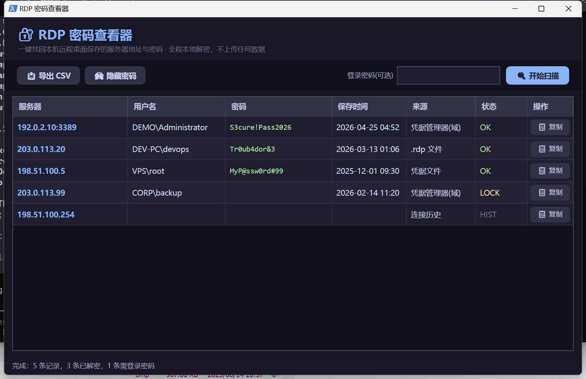
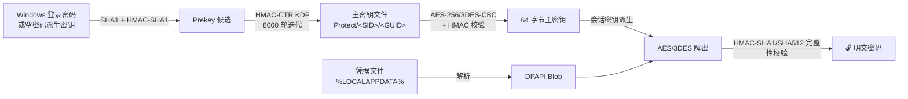

<div align="center">

# 🔐 RDP 密码查看器

**一键找回 Windows 本机保存的远程桌面（RDP）密码。**

*半年前在 mstsc 里点了"记住我"？密码其实一直躺在凭据管理器里——这个工具帮你把它完整取回来。全程本地、秒级、零依赖。*

[](#)
[](#)
[](#)
[](LICENSE)
[](#)

[English](README.md) · [简体中文](README.zh-CN.md)



*上图为演示数据（TEST-NET 保留网段），非真实凭据。*

</div>

---

## 🤔 解决什么问题？

在远程桌面连接里勾选了"记住我"之后，Windows 每次都帮你自动登录，但**再也不给你看密码**。
等你换台电脑、或要把服务器密码告诉同事时，就傻眼了。

本工具从以下位置把密码挖回来：

| 来源 | 恢复内容 |
|:---|:---|
| 🗃️ **凭据管理器** | mstsc 保存的 `TERMSRV/*` 条目（域凭据 + 通用凭据） |
| 📁 **凭据文件** | `%LOCALAPPDATA%\Microsoft\Credentials` 下的 DPAPI 加密 blob |
| 📄 **`.rdp` 文件** | 文档/桌面里的 `full address:` 与 `password 51:b:` 加密串 |
| 🕘 **连接历史** | 注册表 MRU 记录的连过的服务器（含用户名提示） |

## ✨ 特性

- 🎯 **一键** —— 打开即自动扫描解密，无需安装、无需管理员权限
- 🔓 **破解 `CRYPTPROTECT_SYSTEM` 限制** —— 原生实现 DPAPI 底层算法，解开 Windows 拒绝交给用户态 `CryptUnprotectData` 的凭据
- 🧊 **零依赖** —— 单个 `.ps1` 文件，加密调用系统自带 `bcrypt.dll`，不用装 Python / mimikatz / 任何东西
- 🛡️ **100% 离线** —— 所有解密在本地内存完成，不联网、不上传
- 🎨 **深色界面** —— WPF 原生 UI，行内复制、密码遮罩、CSV 导出
- 🖥️ **支持命令行模式** —— 方便脚本化调用

## 🚀 快速开始

> [!IMPORTANT]
> 请**只在自己的电脑上、找回自己的凭据**使用本工具。

1. 下载 / 克隆本仓库
2. 双击 **`Launch.bat`**
3. 完成。若域凭据显示 🔒，在右上角输入 **Windows 登录密码**（不是 PIN）后重新扫描

<details>
<summary>🖥️ 命令行模式</summary>

```powershell
powershell -ExecutionPolicy Bypass -File RDP_Password_Viewer.ps1 -NoGui
powershell -ExecutionPolicy Bypass -File RDP_Password_Viewer.ps1 -NoGui -LoginPassword "你的登录密码"
```

</details>

<details>
<summary>⚙️ 解密链路原理</summary>



mstsc 保存的域类型凭据带有 `CRYPTPROTECT_SYSTEM` 标记——无论提权、令牌模拟还是改
标志位，用户态 `CryptUnprotectData` 都会被系统以 `ERROR_INVALID_DATA` 拒绝。
本工具直接实现 DPAPI 内部算法绕开该限制：
prekey 派生 → 主密钥 KDF → blob 会话密钥派生 → 对称解密 + 完整 HMAC 校验。

</details>

## 🆚 横向对比

| | **RDP 密码查看器** | NirSoft 工具 | mimikatz |
|:---|:---:|:---:|:---:|
| 免下载额外程序 | ✅ | ❌ 需下载 exe | ❌ |
| 零依赖 | ✅ | ✅ | ✅ |
| 不碰 LSASS 内存（不触发杀软） | ✅ | ✅ | ⚠️ 需要 |
| 免管理员 | ✅ | ⚠️ 视情况 | ❌ |
| 单文件源码可审计 | ✅ | ❌ | ⚠️ C++ |
| 图形界面 | ✅ | ✅ | ❌ |

## ❓ 常见问题

<details>
<summary><b>需要管理员权限吗？</b></summary>

不需要。工具读取的都是当前用户自己可访问的数据（凭据管理器、自己 Profile 下的 Protect/Credentials 目录）。

</details>

<details>
<summary><b>为什么要我输 Windows 密码？</b></summary>

域类型凭据用你的登录密码派生的密钥加密。工具会先自动尝试免密码方案（很多机器直接就能解）；失败时输入当前登录密码即可派生正确的 prekey。密码只在本地内存参与运算，不存储、不外传。

</details>

<details>
<summary><b>杀软会报毒吗？</b></summary>

本工具是单个人类可读的 PowerShell 脚本：不访问 LSASS、不注入进程、不含已知黑客工具特征，误报概率很低——而且全部源码一个文件即可审计。

</details>

<details>
<summary><b>能恢复这台电脑上其他用户的密码吗？</b></summary>

不能，也不应该能——每个用户的 DPAPI 密钥相互独立，工具只读当前用户的数据。

</details>

<details>
<summary><b>这合法吗？</b></summary>

在你**自己的电脑**上找回**自己的**凭据，和浏览器里的"显示密码"按钮没有本质区别。用于未授权的机器/账号则不在此列，请阅读下方免责声明。

</details>

## ⚠️ 免责声明

> 本工具仅用于**找回自己拥有的凭据**、以及**经授权的**安全审计与教学用途，
> 作者不对滥用行为负责。另外请记住：如果这个工具几秒就能读出你保存的密码，
> 恶意软件同样可以——请设置强 Windows 密码、开启 NLA、定期轮换服务器凭据。

## 🛠️ 技术栈

`PowerShell 5.1` · `WPF (XAML)` · `C# (Add-Type)` · `bcrypt.dll` · `DPAPI 内部实现` —— 约 55 KB，单文件，无需编译。

## 🤝 参与贡献

欢迎 Issue 与 PR！可以做：英文界面 i18n、端口列识别、Windows Hello 主密钥支持、打包为 choco/scoop 包。

## ⭐ 支持一下

如果这个工具帮到了你，点个 **star** 让更多人看到——谢谢！

## 📄 许可证

基于 [MIT License](LICENSE) 发布。
